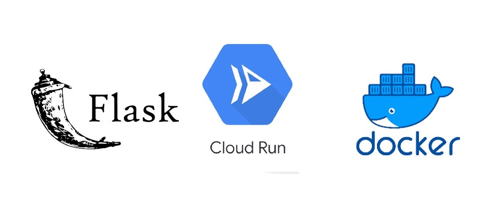

# Web App with GCP Integration



## Overview
This project is a simple web application built with Flask that can be deployed on Google Cloud Platform (GCP). It utilizes containerization with Docker and implements CI/CD using CircleCI.

## Prerequisites
- Python 3.8+
- Docker
- Google Cloud SDK (gcloud)
- CircleCI account

## Setup Instructions
1. Clone this repository:
   ```bash
   git clone https://your-repo-url.git
   cd your-repo-directory
   ```

2. Install dependencies:
   ```bash
   pip install -r requirements.txt
   ```

3. Build the Docker image:
   ```bash
   docker build -t myapp .
   ```

4. Run the Docker container:
   ```bash
   docker run -p 8080:8080 myapp
   ```

5. Test the API using a tool like Postman or curl:
   ```bash
   curl -X POST http://localhost:8080/api/predict -H 'Content-Type: application/json' -d '{"data": "example"}'
   ```

## CI/CD Setup with CircleCI
1. Push your code to a remote repository (GitHub, Bitbucket, etc.).
2. Connect your repository to CircleCI.
3. Define your GCP project ID in the CircleCI configuration file.
4. Set the `GCLOUD_SERVICE_KEY` environment variable in CircleCI with your service account JSON key, base64 encoded.
5. CircleCI will automatically trigger builds on each push to the repository. Deployments to GCP will also occur through defined workflows.

## Deployment Instructions
1. Make sure you have Docker installed.
2. Set up Google Cloud authentication as mentioned in the CircleCI section.
3. Push the Docker image to GCP and deploy it using Cloud Run or GKE based on your preference.

## Conclusion
This project demonstrates a simple framework for building web applications with Flask, deploying them in a containerized format, and automating the CI/CD process using CircleCI and GCP.